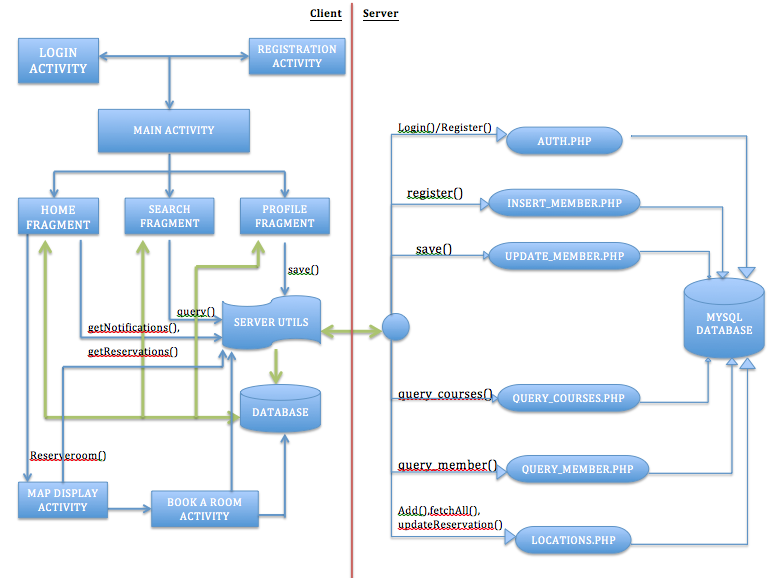

<!--
Use pandoc to generate pdf from markdown file:

PDF:

pandoc -N --template=pdf-template.tex --variable mainfont="Times Roman" --variable sansfont=Arial --variable fontsize=11pt --variable version=1.10 --latex-engine=xelatex --variable title="CS165: DTutor Final Report" --variable author="Travis Peters, Haider Syed, Arvind Kumaran" --toc final_report.md -o Syed_Kumaran_Peters_Final_Report.pdf
-->

<!--
	
-->

#Introduction

DTutor is a specialty smartphone app designed by students for students. The primary goal of this application is to help students of all disciplines find tutors to help them with their courses. We accomplish this by providing a friendly interface that allows tutors and tutees to specify information about themselves and what they are looking for, search for and connect with others, as well as reserve a space for their tutor/tutee sessions. 

In this document we look closer at the user interface, the overall architectural design and interactions between the client and server components, discuss the various contributions of each member, walk through in detail how to setup a similar backend as well as install and run our client android app; we wrap up with a brief discussion of lessons learnt and some proposed future work.

#Architectural Design

##Object Oriented Design Diagram



##Class Descriptions

Below we briefly describe the purpose of each of the classes that we have used in order to architect the dtutor app.

###Package: edu.dartmouth.cs.dtutor

* ```ActivitySingleEntryDisplay.java``` -- Activity to display a full screen description of a particular Tutor/Tutee’s profile information. Also, contains an image button that allows the user to send an email to the person who’s profile they are looking at.  Invoked when an entry in the search results is clicked.

* ```AddFakeRecords.java``` -- Activity used to fill the server database with a list of fake records. The activity will insert records with the names of the members of the all projects in the CS 165 class. Half the class will be entered as tutors and the remaining as tutees.

* ```DtutorDialogFragment.java``` -- General dialog class for displaying a full-screen, transparent, text-only message to the user.

* ```ExpandListAdapter.java (deprecated)``` -- This adapter is used to fill in the Expandable List View in the Search fragment. The rows of the listview are called groups and the rows that appear upon expansion are called children.The adapter fills in values for each of the rows in the list view and also the children that are displayed when the rows are clicked. 

* ```ExpandListChild.java (deprecated)``` -- This class is used to define the data that will be displayed in the children that appear when the rows of the listview are clicked.

* ```ExpandListGroup.java (deprecated)``` -- This class is used to store the data that is displayed in the rows of the Search fragment list view. The Name and About fields of the members are displayed here. 

* ```Globals.java``` -- Dedicated file for holding global constants used in our application.

* ```HomeFragment.java``` -- The fragment that is loaded once the user logs into the app. It contains a toggleswitch that allows the user to browse the app as either a tutor or a tutee, displays the users notifications and reservations, and provides the "reserve a room" button that links the user to the MapDisplayActivity.

* ```LoginActivity.java``` -- Contains user interface and async task for handling user login to the DTutor system. Login is dependent on authentication with a remote database that contains the user's email and password.

* ```MainActivity.java``` -- Activity used to set up the fragments and the action bar. Also, performs check to see if user is logged in and if not, redirects the user to the login page. When the app is closed, the onDestroy() of this activity clears the local database.

* ```MapDisplayActivity.java``` -- Activity for displaying all of the locations (on a map) where there are rooms that can be reserved. 

* ```ProfileFragment.java``` -- Fragment  that displays the profile details of the logged-in user. Provides implementation for the user to add new courses and delete old ones. The information displayed changes based on value of the Tutor/Tutee toggle switch. 

* ```RegisterActivity.java``` -- Contains user interface and async task for handling user registration to the DTutor system. Upon successful registration a user will be logged in and their name, password, and email will be stored in a remote database.

* ```ReservableRoom.java``` -- Data carrier class for keeping track of a room in a building on campus that can be reserved, its physical location (so it can be displayed on a map), and its current reservations (so that the user cannot try to pick a time that is already reserved).

* ```ReservationsActivity.java``` -- Activity that displays the available reservation times for a particular room in a building.

* ```ReservationsBrowseActivity.java``` -- Activity that uses the ReservationsExpandableListAdapter to show users the available buildings/rooms in the reservation system.

* ```ReservationsExpandableListAdapter.java``` -- Subclass of BaseExpandableListAdapter used for displaying buildings/rooms in the reservation system.

* ```SearchFragment.java``` -- Fragment that provides search functionality based on the value of the toggle switch and a user's query specification (i.e. course and course number). Implements AutocompleteTextView and ListViews to display the results. Listview is updated once the text in either of the AutocompleteTextViews is altered. Listview retrieves server information with use of CustomAdapter class (inner class).

* ```TuteeApplication.java (deprecated)``` -- Activity that displays a form for the user to fill in when they register as a tutee (button present on the Home fragment). Displays only those fields relevant to a tutee.

* ```TutorApp.java (deprecated)``` -- Activity that displays a form for the user to fill in when they register as a tutor (button present on the Home fragment).  Displays only those fields relevant to a tutor.

###Package: edu.dartmouth.cs.dtutor.data

* ```AsyncResponse.java``` -- Interface used to read the result of a started AsyncTask. Allows for communication between the AsyncTask thread and other threads.

* ```AuthDatabaseHelper.java``` -- Helper class for interacting with a database intended to manage any authentication related data (i.e. logged in user). 

* ```Course.java``` -- Class used to store information about the courses that the tutor will be tutoring for. Contains subject name, number and current professor’s name.

* ```InsertMemberDb.java``` -- This class calls interfaces with the server and adds a new member to the database on the server; with or without tutor and tutee information.  It takes in a "type" to decide whether it will add any specified courses to the tutor table on the server or to the tutee table on the server.

* ```LocationsDbHelper.java``` -- Helper class/local database which maintains information about the reservation system (buildings/rooms that can be reserved, their physical location, and their current reservations).

* ```MemberDbHelper.java``` -- This class is used to perform the tasks on the local Members database. Used to create the database (with member, tutor and tutee tables) and then perform queries on any of the tables.

* ```Members.java``` -- Defines the memebrs class that is used to encapsulate all the details of the members involved in the app. Tutors and tutees are both considered as members. Also contains helper functions to convert courses information between JSONObjects and Strings. 

* ```QueryDbForCourse.java``` -- This is the class that is called when a search is conducted in the Search fragment.  This class searches the server database and then calls the onProcessFinish function in the class that called it.  The receiving activity can then process the search results as needed.

* ```QueryDbForMember.java``` -- This is the class lets you find users using their email id.  It returns their tutor and/or tutee fields as well if they exist.

* ```UpdateMemberNotifications.java``` -- AsyncTask used to update the notifications field for a member on the server. 

###Package: edu.dartmouth.cs.dtutor.utils

* ```AuthUtilities.java``` -- Utility class which acts specifically as an interface for packaging user data into JSON formatted string, sending/receiving data from the server about login/registration (success or failed), and managing local user database/tables for keeping track of the currently logged-in user.

* ```AuthClient.java``` -- Object that is solely responsible for HTTP connection (send/receive data). 

* ```LocationUtilities.java``` -- Special utility class for packaging location (building/room & reservations) data into JSON formatted string and sending/receiving data to/from the server via HTTP.

* ```ServerUtilities.java``` -- General functions for testing network connections and sending data to a server via HTTP.

* ```SessionManager.java``` -- Class designed to provide easier interface to shared preferences for maintaining/using values relevant to a user's app use experience such as storing the state of the app (i.e. tutor/tutee), etc.

* ```Utils.java``` -- General functions for string/number validation.
 
###DTutorServerSide

* ```config.php``` -- Contains various global definitions that other scripts utilize such as database credentials or other shared/frequently used constants.

* ```DB_Connect.php``` -- Provides a helper class that can be used for easy interfacing with the MySQL database.

* ```DB_Helper.php``` -- Provides a general class which contains methods that abstract away details about MySQL database interactions.

* ```auth.php``` -- Public script that client applications post data to in order to handle user login/registration.

* ```locations.php``` -- Public script that can be used to add new "locations" (buildings/rooms on campus), or fetch/update existing locations in order to handle reservations.

* ```insert_member.php``` -- Public script to add a new member to the server database.  This script can also be used to update an existing member; including their tutor and tutee tables.
* ```query_courses.php``` -- Public script that is used in order to issue a query that will find tutors/tutees for a specified course.

* ```query_member.php``` -- Public script that is used in order to locate a specific user (as defined by their email address in the system).

* ```update_notifications.php``` -- Public script that client applications post data to in order to update a particular member's "notification data" (i.e. add notifications).

* ```update_reservations.php``` -- Public script that client applications post data to in order to update a particular member's "reservation data" (i.e. add reservations).

#Member Contributions Overview

##Travis Peters

**Client-Side:** Worked on getting the login/registration mechanism in place, designed and implemented the map view as well as the interface for navigation of buildings/rooms and selecting times for our in-app reservations UI. Also helped out with the overall design/style of the UI elements in the Home, Search, and Profile fragments.

**Server-Side:** Worked on the authentication and location scripts to faciliate interaction between client applications and our MySQL database.

##Haider Syed

**Client-Side:** Designed the database structure in terms of how all the tables should be setup.  The complete setup for the client-side database (with the exception of the reservations-related fields). Setup the backend for the Search and Profile fragments. Also setup the tutor/tutee toggle switch and the infrastructure and logic for using the value of this tab in other fragments to add members to the database and query the database based on this value.

**Server-Side:** Designed aspects of, and setup, the server-side database. Wrote PHP scripts to interface the Android app to the server-side database including quering and adding members. Wrote the scripts to query the server for tutors/tutees, etc.  Wrote the backend for the Profile fragment to interface it to the server-side database. 

##Arvind Kumaran

**Client-Side:** Worked on getting the Profile fragment set up and also on the Search Fragment functionality. Worked on setting up the UI elements for the Search, Home and Profile fragments, as well as some background functionalities (such as activities called when certain buttons are clicked and dynamic text changes).

**Server-Side:** Worked on query/insert member functionalities that ran on our MySQL database. 

#How-To: Run the Demo

##Server-Side Setup

**Note:** *Below are instructions for starting from scratch and setting up a server running MySQL and PHP, however, we don't expect that everyone will want to go through the whole process everytime they want to use the server for this application - therefore, we have left our server running; please feel free to use our server (while it remains up) for testing/playing with our Android app. [NOTE: server URL: http://members.000webhost.com/login.php, login: haider.syed@dartmouth.edu, password: testing1]*

1. Get the code: svn checkout https://svn.cs.dartmouth.edu/classes/cs65-S14/gradroids/DTutorServerSide/
2. Register for an account with '000webhost'. 
3. Go to CPanel
4. Under "Files" select "Another File Manager"
5. Navigate to the "public_html" directory in the file manager view
6. Use the "Upload file" option in the left column (under "File and Folder Tasks") to upload the server side scripts downloaded in step 1. 

Now your server is setup!

##Client-Side Setup

**Note:** *In order to run the DTutor app you will need our source code as well as the Google Play Services library which allows applications to use services such as Google Maps. The installation directions for this is outside of the scope of this document.*

1. Get the code: svn checkout https://svn.cs.dartmouth.edu/classes/cs65-S14/gradroids/DTutor/
2. Open Eclipse -- Go to File > Import… > Android > Existing Android Code Into Workspace > Browse… > (Navigate to where the project was downloaded to and select "open") > "Finish"
3. Add google_play_services_lib to DTutor: Right-click on the DTutor project > Select "Properties" > Android > Remove the broken link (from our project) by clicking "Remove" with the library selected, then click "Add" and select "google_play_services_lib". 

Now you should have the app setup and ready to run! You can run the app by right-clicking on the project and selecting "Run As" > "Android Application."

#Conclusion

##Leasons Learnt

Along the path to completing our app we have encountered a few lessons and come away with some helpful insight for future work as app developers. Some of these lessons were:

* Having an app that tries to serve both Tutors *and* Tutees is potentially too confusing as someone that would only ever use the app as a Tutor or only as a Tutee; in our effort to make an app that would serve a larger population, we may have made it less appealing to potential users. Becasue of this, in the future we may consider only allowing an individual to sign up as one or the other in an effort to "optimize the user experience" as either a Tutor or Tutee.
* In class we spent a fair amount of time learning how to use Google services as a remote database resource. However, we found Google's services to be unreliable at times and decided to setup our own server/database as a backend resource for our client applications. This was challenging because it forced us to learn about how to work with a new service provider, create server-side handlers in a new way (we learned how to create servlets in class but for our server environment we had to use PHP to handle interactions with a database), and work with a different database (though MySQL shares many similarities to SQLite, there are differences that we had to explore and understand in order to make our app feasible).
* Due to the fact that our app is very "data oriented," we found that there are many challenges that go into designing an efficient and easy to understand database design. We definitely didn't understand all of our data needs at the time of the initial demo and this led to challenges as we had to figure out how to change our evolving database design to incorporate data that we had not previously accounted for -- ultimately I believe this experience will inspire us to be better designers and planners for data-oriented systems in the future.

##Future Work

Despite the fact that we believe that our application is fairly useful in its current state, we believe there are improvements that would make our app an even better tool for those that are looking to tutor/be tutored. In the future we would like to:

*  Include an "automatic match" feature ("find me a tutor" or "find me a tutee"), where no search is required. This is ideal for people that don't know what they are looking for but that do know about their current needs (i.e. I need someone with great experience with the course material for class X). 
* We currently allow students to email prospective tutors/tutees directly once they have found them via the "search" mechanism. This is good but could expose emails/phone numbers unwillingly. An alternative approach could be to allow people to browse only content which you've made publicly available (your courses that you tutor/are tutored in, your "about me" statement, etc.), then allow you to *request* if someone will be your tutor/tutee. When a user approves a request, then and only then will more sensative information be revealed. This notion of "notifications" is something we believe would improve our app.
* The reservation system looks nice and helps to illustrate how it could be used (a proof of concept if you will), however in its current state it isn't a useful feature. Idealy it would be connected to the Dartmouth reservation system and allow users to *actually* reserve a room. Additionally, we aught to take into consideration the fact that Dartmouth doesn't typically book rooms for one-on-one meetings. The "book a room" feature could actually become more of a "meet me here at time X" where "here" could be a public place like Novak Cafe or somewhere in Baker-Berry library.

